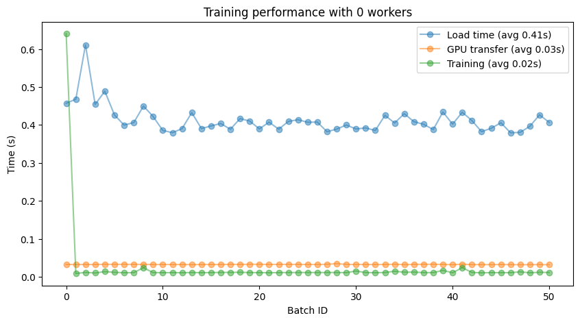
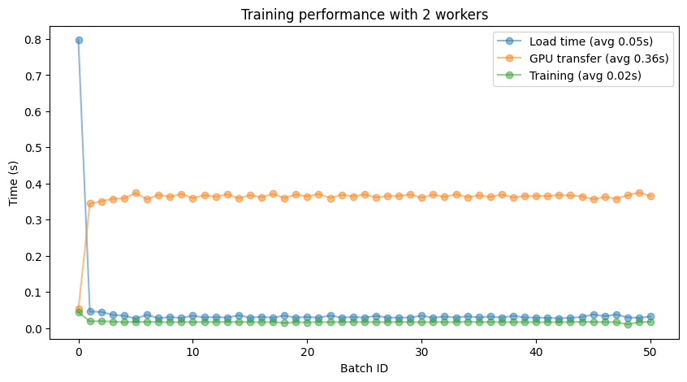
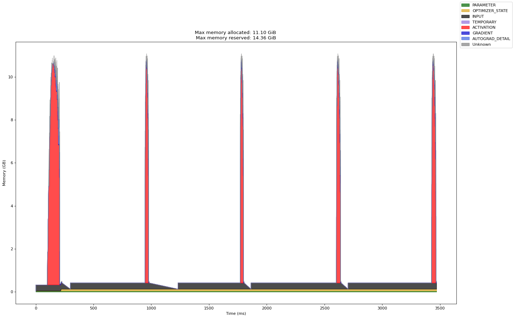
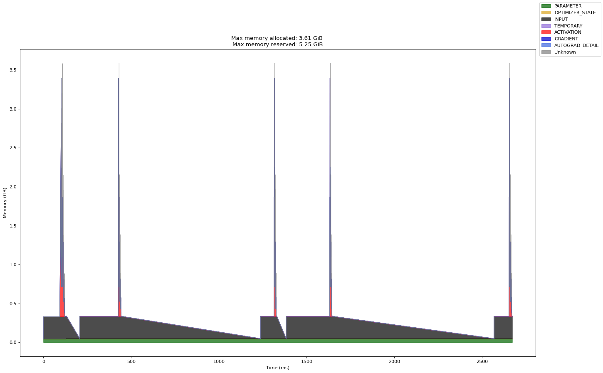

## Tiny imagenet experiments
- Goal is to reduce time taken to train resnet19 on tinyImagenetDataset without sacrificing accuracy. 
    - There are 100,000 images that need to train for 100 epochs for convergence in the dataset
    - Resnet19 architecture is used as the model
    - Time taken to train one epoch on dataset for different models is measured between baseline resnet, with gradient checkpointing, with data parallel and distributed data parallel. 
- Where are the bottlenecks
    - The first observation is setting number of workers to 2 pushes bottleneck away from data loading to gpu transfers. 
    
    
    - The second observation is that activations consume a gigantic amount of memory, thus this can benefit from gradient checkpointing and increasing batch size. Memory consumption of resnet with batch size 512 is shown below, you can see that most of memory is used for activations, which is true for many CNNs. First activation shape is (112, 112, 64), then memory foot print is 112 * 112 * 64 * 4 / (1024 * 1024) = 3 MB for one image. For a batch size of 100, just the first activation layer consumes 300 MB. For batch size 512 memory, peak memory usage is 14.36GB.
    
    - Memory footprint of resnet with batch size 512 is shown below. It has dropped down to 5.25 GB. We are now able to fit upto batch size 2048 in memory
    
    - To further reduce training time, training is done on 2 GPUs with data parallel and ddp enabled

- Estimated Time taken for one epoch = (N / B) * time per batch
    - Baseline
        - 100000 / 512 * 0.57 = 111
    - Gradient checkpointing
        - 100000 / 1500 * 2 = 133
    - DP
        - 100000 / 2500 * 3.5 = 140
    - DDP
        - Should be faster than DP < 140 because of efficiency. 
- Benchmarking data is present below
    - Experiments were conducted on 2 RTX5000 GPUs with 16GB VRAM from https://jarvislabs.ai/templates/pytorch
    - For 100 epochs, baseline should take 18700 seconds, which is 5 hours, whereas DDP takes 9600 seconds, which is about 2.5 hours. With 2 GPUs, ddp is able to cut down training time by half. With n GPUs, it is typically by a factor of n if the model fits in memory

| Name | batch_size | num_workers | gradient_checkpointing | data_parallel | distributed_data_parallel | Processing Time per batch | Estimated Time 1 epochs | Actual Time 1 epochs | Comments |
|---------|------------|-------------|--------------------------|-------------------|--------------------------------|--------------------------------|---------------|-------------|-----------|
| baseline | 512 | 2 | False | False | False | 0.57 | 111 | 187 | Standard training setup |
| gradient_checkpointing | 1500 | 2 | True | False | False | 2 | 133 | 125  | Trades computation for memory savings |
| data_parallel | 2500 | 2 | False | True | False | 3.5 | 140 | 127 | Uses DataParallel for multi-GPU training |
| distributed_data_parallel | 1500 | 2 | False | False | True | |  | 96  | Uses DistributedDataParallel for better efficiency |

- To run the experiments, run 
    - Use a standard pytorch container from https://jarvislabs.ai/templates/pytorch, spin up 2 RTX 5000 GPUs and run `pip install -r requirements.txt`
    - For baseline, `python baseline_resnet.py --batch_size 512`
    - To enable gradient checkpointing `python baseline_resnet.py --batch_size 1500 --enable_checkpointing True`
    - To run checkpointing with dp `python baseline_resnet.py --batch_size 1500 --enable_checkpointing True --enable_data_parallel True`
    - To run checkpointing with ddp `python checkpointed_ddp_resnet.py --batch_size 1500 --num_gpus 2`. Checkpointing is enabled by default for ddp